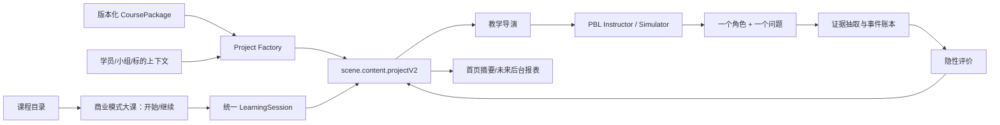

# 九轩阁商业模式大课统一对话学习设计

状态：评审稿  
日期：2026-07-10  
适用范围：第一阶段商业模式大课；后续可扩展到九轩阁其余五门大课。

## 1. 设计结论

学员选择“商业模式大课”后，进入一个持续、可断点恢复的统一对话空间。学员不再手动选择七个模块，不看学习地图，也不在多个 Agent 聊天室之间切换。

后台将整门课程实例化为一个 `PBLProjectV2`：A-G 七个课程模块映射为七个隐藏 milestone；当前 microtask、学员证据与评价结果共同决定下一问、下一位发言角色和状态迁移。

核心关系是：

```text
对话产生证据 -> 证据触发评价 -> 评价决定下一教学动作 -> 教学动作更新同一个 projectV2
```

学习路径不是对话旁边的导航组件，而是对话背后的状态机。

## 2. 已采用的产品决策

1. 一门课只有一条长期对话和一个权威运行状态。
2. 第一阶段按 A-G 固定顺序推进；AI 可以调整模块内部的节奏与追问深度，但不跳过或重排模块。
3. 课程内容、案例事实、证据标准与迁移规则预生成、人工校准并版本化。
4. 运行时 AI 只负责基于当前状态和事实生成下一问，不得临时改写课程标准。
5. “六要素拆解”作为首条真实垂直验证链路；测试环境可以直接从 B 模块启动，正式课程仍按 A-G 推进。
6. `scene.content.projectV2` 是唯一学习运行状态源。
7. `courseProgress` 只允许作为可重建的定位缓存，不能决定 started、completed 或 evaluation。
8. 评价分数、内部维度、证据门槛、反速通规则不向学员暴露。
9. 教授、学长、神秘角色、成长反馈官由后台教学导演选择，每轮最多一位角色发言。
10. 第一阶段保留现有 PBL v2 API、SSE、Evaluator、Simulator 和 Workspace 主链。

## 3. 目标效果

### 3.1 学员体验

- 从课程目录进入商业模式大课，只有“开始学习”或“继续学习”。
- 首次进入直接收到与课程或真实项目有关的一个问题。
- 每轮只面对一个问题或一个明确动作。
- 概念、案例、反馈和过渡卡都出现在同一对话流中。
- 离开后自动保存；回来后从上次卡点和下一问继续。
- 看不到 A-G 路径、学练评测阶段、分数、追问层级或内部状态名。

### 3.2 教学效果

- 只有形成可定位、可追溯的学习证据才允许迁移。
- 套话、复读、复制、寒暄和无事实长文不能触发迁移。
- AI 不替学员命名核心矛盾，只通过事实张力与单问追问逼近。
- 缺事实时先追问事实，不编造课程内容或项目情况。
- 学员看到的是“需要补充什么”，后台保存的是完整评分与证据链。

### 3.3 系统效果

- 任意时刻只有一个权威 `PBLProjectV2`。
- 首页、继续学习摘要和未来后台报表均从权威状态派生。
- 同一个学员回合只能产生一次 Agent 回复和一次状态迁移。
- checkpoint 可由事件账本重建；课程或事实版本变化不能静默污染旧会话。

## 4. 范围

### 第一阶段包含

- 商业模式大课单一课程入口。
- 单一持久对话空间。
- A-G 七个隐藏 milestone 的结构。
- 六要素拆解的完整课程包与真实垂直链路。
- 教授、学长、神秘角色、成长反馈官的后台路由。
- 单问、证据判断、隐性评价、过渡卡和断点恢复。
- 固定基准、节点对话、红队和人工校准测试。
- 功能开关与逐切片回退。

### 第一阶段不包含

- 小组多人并发 PBL。
- 正式教练后台与全国排名。
- 学员端完整评价报告。
- 五至八题正式综合测评。
- 有效十小时的正式计费或认证。
- A-G 自适应跳转。
- 六门课程全部内容包。

这些能力保留数据与接口扩展点，但不进入第一阶段上线门槛。

## 5. 系统架构



### 边界

- `CoursePackage`：静态、版本化、可评审；定义课程事实和完成契约。
- `PBLProjectV2`：动态、权威；保存当前学习运行状态。
- `LearningSessionRef`：只定位 `courseId -> stageId -> sceneId`；不保存完成事实。
- 教学导演：根据当前 project 和评价结果选择下一教学动作，不维护第二套路径。
- 前端：只渲染当前对话、卡片和恢复摘要，不自行判断完成。

## 6. 课程包模型

```ts
export interface JiuxuangeCoursePackage {
  id: 'business-model';
  version: string;
  releaseStatus: 'pilot_b_only' | 'full';
  title: string;
  modules: JiuxuangeCourseModule[];
  concepts: Record<string, JiuxuangeConcept>;
  cases: Record<string, JiuxuangeCase>;
  questionTemplates: Record<string, JiuxuangeQuestionTemplate>;
  evidenceRules: Record<string, JiuxuangeEvidenceRule>;
  transferRules: JiuxuangeTransferRule[];
}

export interface JiuxuangeCourseModule {
  id: string;
  code: 'A' | 'B' | 'C' | 'D' | 'E' | 'F' | 'G';
  order: number;
  title: string;
  learningObjective: string;
  conceptIds: string[];
  caseIds: string[];
  questionTemplateIds: string[];
  evidenceRuleIds: string[];
}

export interface JiuxuangeConcept {
  id: string;
  name: string;
  definition: string;
  distinctions: string[];
  misconceptions: string[];
  applicationCriteria: string[];
  sourceRefs: Array<{ source: string; locator: string }>;
}

export interface JiuxuangeCase {
  id: string;
  title: string;
  conceptIds: string[];
  facts: Array<{
    id: string;
    text: string;
    source: string;
    observedAt?: string;
    confidence: 'low' | 'medium' | 'high';
  }>;
}

export interface JiuxuangeQuestionTemplate {
  id: string;
  phase: 'ground' | 'apply' | 'compare' | 'tension' | 'judge' | 'test' | 'reflect';
  conceptIds: string[];
  prompt: string;
  singleQuestion: true;
}

export interface JiuxuangeEvidenceRule {
  id: string;
  description: string;
  requiredSignals: Array<'own_words' | 'distinction' | 'fact_ref' | 'causal_link' | 'boundary' | 'counterevidence'>;
  provenanceRequired: boolean;
}

export interface JiuxuangeTransferRule {
  fromModuleId: string;
  whenEvidenceRuleIds: string[];
  toModuleId?: string;
}
```

课程包不保存学员进度、对话或评价结果。

## 7. PBL v2 映射

| 九轩阁对象 | OpenMAIC PBL v2 对象 |
|---|---|
| 整门商业模式大课 | 一个 `PBLProjectV2` |
| A-G 模块 | 七个 `PBLMilestone` |
| 当前教学动作 | `PBLMicrotask` |
| 对话记录 | `PBLAgentThread.messages` |
| 学员提交 | `PBLSubmission` |
| 过程评价 | `PBLEvaluation` |
| 有效参与与概念解锁 | `PBLEngagementEvent` 与 microtask engagement cache |
| 事实性运行记录 | `PBLRuntimeEvent` |
| 模块过渡 | `pendingHandover` |
| 当前任务完成待确认 | `pendingTaskCompletion` |

PBL v2 原有 `Hero -> Workspace -> Completion` 生命周期保留。九轩阁入口直接创建或恢复项目；学员不需要看到 PBL 内部术语。

## 8. 隐藏状态机

每个 milestone 使用相同的教学语义阶段：

```text
concept_intro
  -> concept_probe
  -> concept_evidence_pending
  -> concept_unlocked
  -> handover_to_case
  -> case_probe
  -> case_evidence_pending
  -> feedback_ready
  -> dimension_repair
  -> module_completed
```

这些阶段不新增为第二套生命周期枚举。它们通过 microtask blueprint、当前 microtask、evidence 和 pending handover 表达。

### 概念进入案例的最低门槛

- 学员能用自己的话解释核心概念。
- 能区分至少一个常见误区。
- 能回答一个反向问题。
- 证据能定位到原始消息。

### 案例进入下一模块的最低门槛

- 引用具体案例或项目事实。
- 给出判断和理由。
- 形成至少一段因果关系。
- 说明判断成立的边界或反证条件。
- 修复成长反馈官指出的关键缺口。

## 9. 单轮编排契约

每个 learner turn 按以下顺序提交：

```text
learner_message
-> evidence_candidates
-> evaluation_decision
-> next_learning_action
-> visible_agent
-> agent_message
-> project_patch
-> checkpoint
```

必须满足：

- 一个 learner turn 恰好一个可见 Agent 回复。
- 回复最多包含一个明确问题或一个按钮动作。
- 未回答当前问题时，不追加第二个问题。
- 未满足证据门槛时，不推进 microtask 或 milestone。
- 整个提交使用幂等 request ID；失败重试不能产生重复迁移。

## 10. 多 Agent 角色

| 可见角色 | 教学动作 | 禁止行为 |
|---|---|---|
| 教授 | 建立概念边界、纠偏、收束 | 长篇灌输、连续抛出多个问题 |
| 学长 | 引入案例事实、连接真实项目 | 编造项目数据、替学员完成判断 |
| 神秘角色 | 提供反例、角色模拟、红蓝军张力 | 公布标准答案、直接命名核心矛盾 |
| 成长反馈官 | 镜像证据、指出待补维度、生成过渡 | 展示分数、排名、内部模型 |

后台 Evaluator 不作为第五个角色出现。角色路由是教学动作选择，不创建四条独立线程。

## 11. 学员端体验

### 课程目录

- 未开始：商业模式大课 + “开始学习”。
- 已开始：商业模式大课 + “继续学习” + 上次讨论摘要。
- 不展示 7 模块、14 卡片、完成百分比或有效分钟。

### 统一对话空间

- 顶部：课程名称与返回课程目录。
- 中部：连续消息、案例卡、反馈卡、过渡卡。
- 底部：输入框、附件与语音。
- 不展示 Agent 选择器、学习地图或独立行动/测评按钮。

### 对话内卡片

- 案例卡：只呈现本轮允许使用的已核验事实。
- 反馈卡：说明需要补充的维度，不显示分数。
- 过渡卡：总结刚形成的认知变化，提供一个继续动作。

## 12. 断点恢复

结构化 checkpoint 至少包含：

```ts
export interface JiuxuangeLearningCheckpoint {
  courseId: string;
  courseVersion: string;
  factPackHash: string;
  stageId: string;
  sceneId: string;
  milestoneId: string;
  microtaskId: string;
  activeQuestion: string;
  lastValidLearnerClaim?: string;
  evidenceRefs: string[];
  missingDimensions: string[];
  activeAgentRole: 'professor' | 'senior' | 'mystery' | 'growth-feedback';
  pendingHandoverId?: string;
  updatedAt: string;
}
```

checkpoint 是从 `projectV2` 派生的恢复索引，不是第二事实源。恢复时必须校验 `courseVersion` 与 `factPackHash`；不兼容则继续旧版本或执行显式迁移。

## 13. 六要素拆解垂直样例

测试环境允许从 B 模块启动，验证：

```text
概念边界
-> 事实来源追问
-> 六要素应用
-> 对照案例
-> 制造事实张力
-> 学员自主命名矛盾
-> 商模判断与反证
-> 最小验证设计
-> 缺失维度修复
-> milestone handover
```

初始事实样例：

- `f1`：付费用户增长快，但续费率低，置信度 high。
- `f2`：销售主要依赖创始人人脉，置信度 medium，来源需补充。

在真正运行前，课程团队必须补齐六要素定义、边界、常见误区、连锁加盟案例事实正文和人工评分 rubric。缺少这些资产时，不允许用通用 LLM 生成内容冒充真实课程。

## 14. 数据与持久化

### 权威数据

- `db.scenes[].content.projectV2`：运行状态、对话、证据、评价、handover。
- 版本化课程包：课程事实、问题模板与完成规则。

### 派生数据

- 首页开始/继续状态。
- 上次讨论摘要。
- 模块完成数、有效时长和后台报表。
- 教练证据卡和异常卡。

### 现有表处理

- `learningPaths`：保留，降级为课程定位与 resume hint。
- `courseProgress`：保留 schema，不再写 started/completed 事实。
- `learningEvaluations`：保留 schema，不再作为评价事实源。
- 第一阶段不删除或迁移旧数据，以保证回退。

## 15. 错误处理

- Agent 超时：学员消息已保存，状态不迁移，允许幂等重试。
- 重复发送：相同 request ID 只接受一次。
- 课程事实缺失：停留当前 microtask，追问来源或标记待核验。
- checkpoint 损坏：从 project runtime events 与 thread 重建。
- 课程版本不兼容：继续旧课程包，不静默升级。
- 派生摘要失败：首页降级为“继续学习”，不修改 project。
- 项目缺少 PBL scene：显示可恢复错误，不创建伪进度。

## 16. 测试策略与上线门槛

### 固定测试层

1. 固定基准集。
2. 节点对话集。
3. 红队攻击集。
4. 人工校准集。
5. 真实试点回放集。

### 必测不变量

- 断点恢复到同一 milestone、microtask、证据版本和下一问。
- 每轮一个 Agent、一个问题。
- 不泄露内部结构。
- 不替学员发现或命名矛盾。
- 无证据时不迁移。
- 课程和项目事实引用可追溯。
- 评价能回到原始消息、课程规则与 rubric 版本。
- 重复、套话和刷屏不增加有效指标。

### 上线门槛

- 固定基准集通过率不低于 95%。
- 直接给答案、泄露内部结构、替学员命名矛盾出现任一失败，不上线。
- 并发和重试测试中，每个 learner turn 恰好一次回复、一次状态迁移。
- 断点关键字段恢复一致率 100%。
- 所有正式评价 trace 完整率 100%。
- AI 与人工金标准偏差超阈值时，评价不能进入正式报表。

## 17. 实施切片

1. 固化现状与回归基线。
2. 用课程级开始/继续入口替换可见七模块路径。
3. 建立课程包 schema 和六要素内容包。
4. 建立课程项目 factory：一个 project、七个 milestone。
5. 接入教学导演与四角色映射。
6. 接入证据决策、隐性反馈和断点摘要。
7. 跑通六要素端到端垂直链路。
8. 通过红队与人工校准后扩展 A-G 内容。

## 18. 回退方案

- 以当前 `codex/jiuxuange-openmaic-checkpoint` 分支和提交 `e9b1f1d` 作为已知网页基线。
- 新体验置于 `NEXT_PUBLIC_C_CUBIC_UNIFIED_LEARNING` 功能开关后。
- 保留 `BusinessModelLearningPath` 组件，第一轮只停止渲染。
- 保留 v13 三张学习表及旧数据。
- 新增 manifest 和 project 字段均为可选，旧课堂继续运行。
- 不修改 PBL v2 API/SSE/Workspace 主链。
- 每个实施切片独立提交；关闭功能开关即可恢复旧首页和旧入口。

## 19. 评审重点

本评审稿使用以下明确假设：

1. 第一阶段固定 A-G 顺序。
2. 课程标准预生成并版本化。
3. 六要素拆解是首条真实垂直链路。
4. 第一阶段只做单人本地会话，不做多人后端。

任何一项改变都需要重新评估课程包、项目 factory、状态迁移和测试范围。
