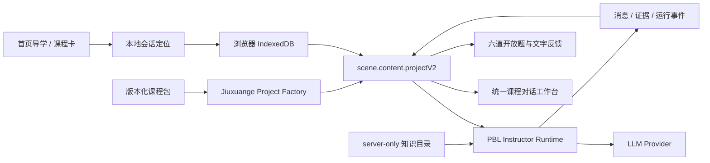
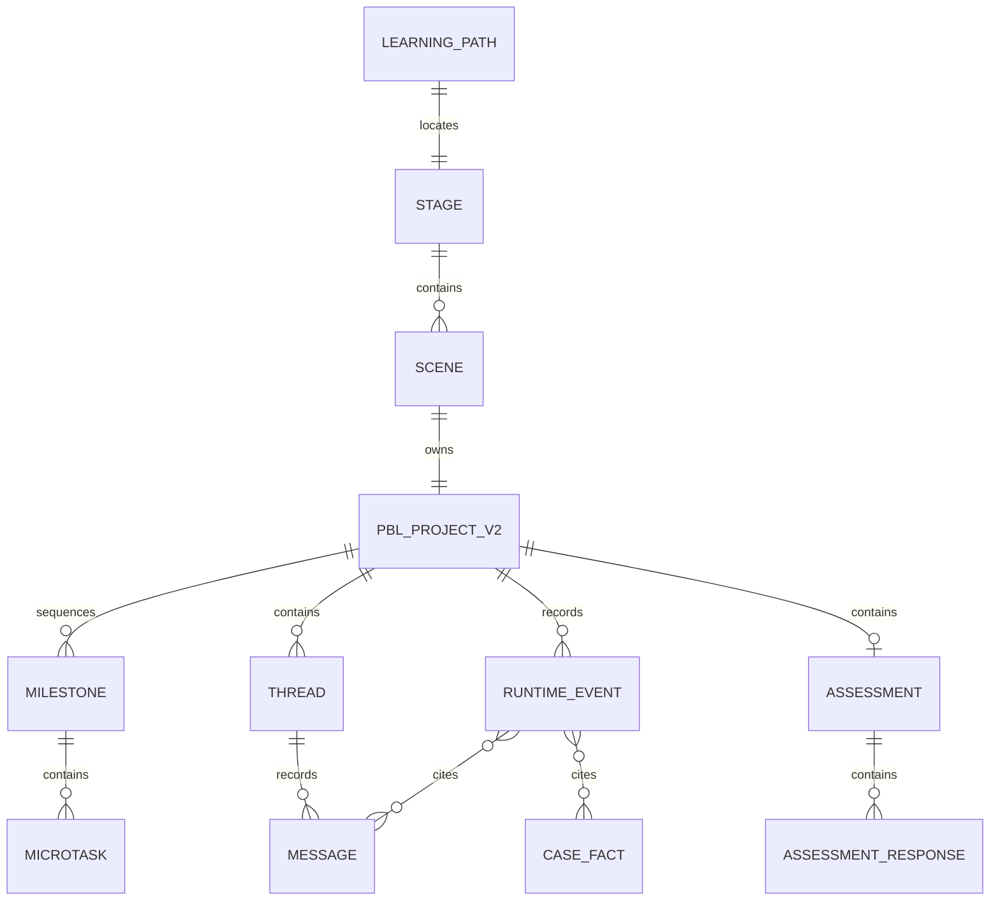

# 当前系统架构

## 1. 当前产品形态

九轩阁代码运行在 OpenMAIC Next.js 应用内。商业模式课程被编译为一个 `PBLProjectV2`，存放在场景的 `scene.content.projectV2` 中；前端用 PBL v2 Workspace 展示对话、任务和提交。



## 2. 关键组件

| 责任 | 当前实现 | 事实边界 |
|---|---|---|
| 课程静态定义 | `lib/c-cubic/course-package/` | 概念、案例、问题、证据规则和版本 |
| 课程编译 | `lib/c-cubic/project-factory.ts` | CoursePackage 转为 PBLProjectV2 |
| 会话定位 | `lib/c-cubic/session.ts` | 组合键定位 stage/scene，不应保存学习结论 |
| 学习运行状态 | `scene.content.projectV2` | 当前唯一运行时真相 |
| 教学导演 | `lib/c-cubic/runtime.ts` | 依据导学阶段或当前问题选择可见角色与唯一问题 |
| 教学回合 | `lib/pbl/v2/agents/instructor.ts` | 接收学员消息、记录事件、生成或降级到下一问 |
| 证据判断 | `lib/c-cubic/evidence.ts` | 判断 own words、事实引用、因果、边界和反证 |
| 知识检索 | `lib/c-cubic/knowledge/` | 确定性节点检索，盲解前隐藏分析 |
| 测评 | `lib/c-cubic/assessment/` | 六题原文、来源、文字反馈；正式分数关闭 |
| 前端 | `components/c-cubic/` 与 PBL v2 renderer | 课程入口、导学、工作台和反馈面板 |

## 3. 当前状态模型

### 导学状态

```text
problem -> baseline -> goal -> assessment_contract -> complete
```

首页完成 `problem`；课程内完成基线、目标与测评约定。导学完成后插入一次正式开场，再进入概念链。

### 正式课程状态

V2 课程包现在包含：

```text
A 交易原理
-> B 六要素总览
-> C 定位
-> D 业务系统
-> E 关键资源能力
-> F 盈利模式
-> G 现金流结构与企业价值
-> H 便利蜂案例
-> I 生鲜零售比较
-> J 六道开放题
```

这些字母和节点是后台课程编排，不应作为学员手动导航。

### 单案例状态

```text
blind -> commit -> unlock -> compare
```

- `blind`：只给学员事实。
- `commit`：要求学员先锁定自己的判断。
- `unlock`：开放少量作者分析，用于检验而非公布答案。
- `compare`：比较事实、学员判断与作者判断，并迁移到新情境。

## 4. 数据架构



当前所有这些对象最终保存在浏览器 IndexedDB。代码层已把 `learningPaths` 定义为定位索引，但尚没有服务端事件库或管理员数据仓库。

## 5. 信任边界

| 边界 | 当前事实 | 风险 |
|---|---|---|
| 浏览器 -> Next API | 浏览器把模型配置写入请求头 | 供应商密钥仍出现在客户端运行环境，不适合正式开放 |
| Next API -> LLM | 服务端根据请求解析模型并调用 Provider | 超时已可降级，但没有全局限流、成本配额和用户级审计 |
| 私有教材 -> Instructor | `server-only` 目录按节点提供短片段 | 源文件定位仍依赖本机绝对路径，部署环境不可直接复用 |
| 学员事实 -> 证据判断 | 只接受 verified + learner-visible 事实 | 事实核验流程尚未产品化，主要由代码包静态维护 |
| 教练判断 -> 学员 | coach_review 被限制为 coach_only | 有测试保护，但还没有真实教练后台和人工发布动作 |

## 6. 当前架构风险

1. **浏览器是数据库**：清缓存、换设备或浏览器淘汰存储都会影响续学和证据完整性。
2. **Prompt 与业务规则耦合**：Instructor 文件同时处理通用 PBL、九轩阁导学、证据和降级，复杂度持续上升。
3. **本地路径依赖**：知识目录的源文件路径不能直接部署到云端。
4. **事实核验非工作流**：`verified` 目前主要是代码里的人工标记，不是带审批记录的业务状态。
5. **评价仍是原型**：结构已保存证据，但部分反馈是确定性模板，AI 草评没有人工偏差基线。
6. **发布状态过载**：课程包的 `full` 容易被误解为产品可正式上线。

## 7. 不存在的能力

- 没有正式认证、组织账号、花名登录或租户权限。
- 没有管理员/教练后台。
- 没有有效十小时统计。
- 没有生产级小组项目导入。
- 没有正式分数、排名或结业判断。
- 没有计划任务和邮件通知。
