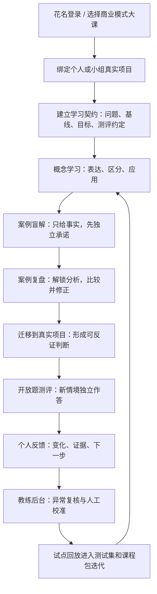
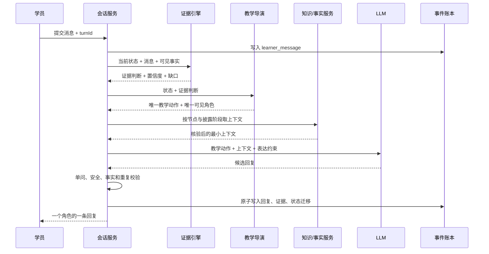

# 九轩阁业务逻辑 V3

## 1. 产品本体

九轩阁智能学习伙伴不是“通用聊天框 + 课程入口 + 多 Agent 展示”的组合，而是：

> **围绕一个真实问题，以课程知识、项目事实和证据门驱动的一条长期学习会话。**

因此：

- 首页导学不是独立聊天产品，而是课程会话的第一阶段。
- 课程路径不是学员手动点击的目录，而是后台状态机。
- 四个 Agent 不是四套业务逻辑，而是教学导演选出的四种可见教学动作。
- 知识库不是“让模型自由检索整本书”，而是课程节点允许读取的核验上下文。
- 测评不是课程末尾突然出现的试卷，而是对全过程证据的最终迁移检查。
- 后台不是查看聊天记录，而是查看状态、证据、异常和人工待决项。

## 2. 北极星结果

产品目标不是“让学员聊满十小时”，而是：

> 学员面对自己的真实项目，能从依赖 AI 指出矛盾，逐步转为自己引用事实、建立因果、提出反证并修正判断。

十小时只应是投入约束，不是学习成果。核心结果应由以下变化表示：

| 目标 | AI 原生观测 |
|---|---|
| 学习速度 | 从 AI 制造张力到学员自主发现张力的有效回合与时间 |
| 认知深度 | 学员在事实、因果、边界、反证上能推进到哪一层 |
| 成长质量 | 自主证据密度和判断修正质量随时间的变化曲线 |
| 教练效率 | 教练只处理高风险判断、低置信证据和关键转折所需时间 |

## 3. 统一业务主链



任何页面、Agent 或指标都必须能落在这条主链上，否则不进入下一阶段范围。

## 4. 六个业务域

### 4.1 身份与组织域

核心对象：`Learner`、`Alias`、`Group`、`Enrollment`。

规则：

- 花名是业务身份，不是浏览器随机字符串。
- 一个学员可参加多门课程；一门课可以个人学习，也可以绑定小组。
- 所有消息、证据、提交、人工判断必须归属到明确学员与课程实例。

### 4.2 课程内容域

核心对象：`CoursePackage`、`ConceptNode`、`KnowledgeSection`、`CasePackage`、`RubricVersion`。

规则：

- 原始 PDF/PPT/Markdown 先标准化为带来源定位的知识片段，再进入课程包。
- 主教材、课程覆盖、扩展阅读有确定优先级。
- 学员事实与作者/教练分析物理分层。
- 发布课程包不可原地修改，只能新版本；旧会话继续使用旧版本。

### 4.3 项目事实域

核心对象：`Project`、`ProjectFact`、`FactSource`、`FactVerification`。

规则：

- 项目材料先进入待核验区，不能直接成为 Instructor 的事实。
- 每条事实保存来源、定位、观察时间、置信度、验证状态和可见范围。
- 教练结论、学员主张和外部事实不能混为同一种数据。

### 4.4 学习运行域

核心对象：`LearningSession`、`LearningState`、`Turn`、`TeachingAction`、`RoleView`。

规则：

- 一门课一个长期会话，一个权威状态。
- 每个学员回合只能提交一次，使用幂等 `turnId`。
- 每轮只有一个可见角色、一个问题或一个明确动作。
- LLM 负责表达教学动作，不负责决定是否推进。

### 4.5 证据与评价域

核心对象：`EvidenceClaim`、`EvidenceDecision`、`AssessmentResponse`、`HumanReview`。

规则：

- 每个评价回到原始消息、事实 ID、提示等级、模型和课程包版本。
- 区分自主发现、提示后发现、答案泄露和无证据套话。
- AI 草评与人工金标准未校准前，不得成为正式分数。
- 学员端看到自然语言反馈；教练端看到维度、置信度和证据链。

### 4.6 运营与迭代域

核心对象：`AnomalyCard`、`CoachQueue`、`EvalRun`、`DecisionLog`、`ReleaseGate`。

规则：

- 教练不重读全量对话，只处理高价值证据卡和异常卡。
- 每次产品、Prompt、模型、课程包或 rubric 改动都跑同一批版本化测试集。
- 真实失败必须脱敏进入红队或回放集。

## 5. 单回合决策链



### 硬规则

1. 状态迁移由代码中的证据决策触发，不由 Prompt 或模型自报完成触发。
2. LLM 失败时可换表达或使用确定性教学动作，但不能重复写入回合。
3. 无事实时只能追问事实；未独立承诺前不能解锁作者分析。
4. 对短回答要判断语义角色。例如“可以”在接受系统提议时是有效动作，在开放题里不是有效证据。

## 6. 学习状态机

```text
enrolled
-> project_bound
-> orientation.problem
-> orientation.baseline
-> orientation.goal
-> orientation.contract
-> concept_cycle*
-> case_cycle_1
-> case_cycle_2
-> project_transfer
-> assessment
-> feedback
-> completed
```

每个 `concept_cycle` 内部：

```text
expose_minimum_context
-> learner_explains
-> boundary_probe
-> evidence_check
-> repair_or_advance
```

每个 `case_cycle` 内部：

```text
blind_facts
-> learner_commitment
-> analysis_unlock
-> comparison
-> counterevidence
-> transfer
```

## 7. 入口设计决策

首页不得同时呈现两个语义相近、都像“开始”的主入口。

建议收敛为一个课程主入口：

- 未开始：课程卡内部直接显示“带着一个真实问题开始”的输入。
- 已完成首页导学：同一课程卡显示“继续完成学习契约”。
- 正式学习中：只显示“继续学习”和上次卡点。
- 已完成：显示“回看反馈”和“继续验证项目判断”。

通用 AI 问答若保留，必须放到独立的“临时咨询”产品域，明确说明不计入课程证据、不改变课程进度，不能与课程输入共用同一主视觉。

## 8. 后台最小闭环

第一版后台只做四个视图：

1. **学习状态**：每人当前节点、最后活跃、是否卡住。
2. **证据卡**：自主发现、提示后发现、判断修正和项目迁移的原文证据。
3. **异常队列**：重复追问、模型降级、事实不足、疑似刷时长、评分低置信。
4. **人工校准**：教练接受、修改或拒绝 AI 判断，并记录理由。

不先做排行榜、总分大屏或全量聊天阅读器。

## 9. 下一垂直切片

只选择一个核验真实项目和 5-10 名学员，完整跑通：

```text
花名登录
-> 导入并核验项目事实
-> 完成导学
-> 学完六要素核心节点
-> 完成便利蜂盲解
-> 迁移到自己的项目
-> 完成六题测评
-> 收到非分数反馈
-> 教练复核证据
```

验收不是“页面都能点”，而是：

- 断点恢复成功率 100%。
- 高危泄露 0 次。
- 重复问题不能形成连续死循环。
- 每个推进动作都有原始消息或事实证据。
- 教练能在不读全量聊天的情况下复核关键判断。
- 至少出现一次有证据的判断修正或反证补充。
