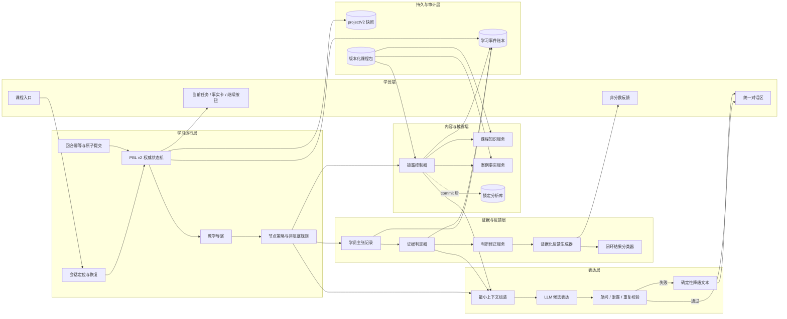
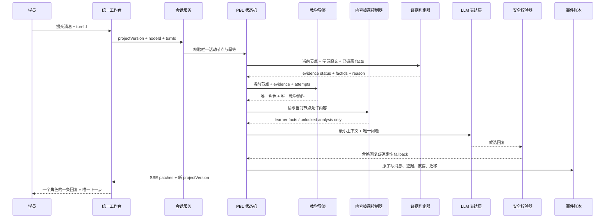
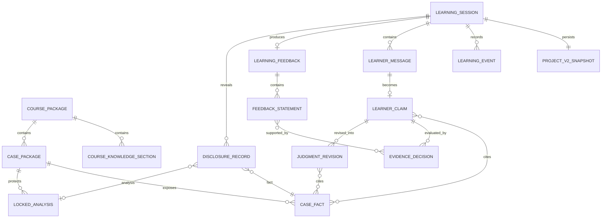

# 商业模式大课学习闭环 V5：业务与数据架构

状态：**设计提案，尚未实现**  
架构版本：`learning-loop-architecture.v1`  
对应节点合同：[learning-loop-v5-node-contracts.md](./learning-loop-v5-node-contracts.md)

## 1. 架构结论

- [KNOWN, HIGH] OpenMAIC PBL v2 继续作为任务、对话、提交、事件和恢复主链。
- [INFERRED, HIGH] V5 不增加第二套课程进度；十节点由 PBL milestone/microtask 状态派生。
- [INFERRED, HIGH] V5 增加的是课程域对象和策略服务，不重写 PBL 引擎。
- [INFERRED, HIGH] LLM 只能生成候选表达，不能读取未披露内容、决定证据状态、解锁案例或迁移节点。
- [INFERRED, HIGH] 所有服务端决策先写事件和状态，再向客户端发送同一原子结果；禁止只写服务端内存而不回传浏览器。

## 2. 业务系统架构图



## 3. 权限与责任边界

| 能力 | 唯一责任方 | LLM 权限 | 客户端权限 |
|---|---|---|---|
| 当前节点 | PBL 状态机 | 只读当前节点 | 只显示，不自行计算迁移 |
| 角色选择 | 教学导演 | 不得自行换角色 | 显示指定角色 |
| 案例披露 | 披露控制器 | 只收到已披露内容 | 只保存已披露内容 |
| 锁定分析解锁 | 节点策略 + commit 事件 | 无权解锁 | 不预载锁定内容 |
| 证据状态 | 确定性证据判定器；后续可加可解释分类器 | 可给候选理由，不做最终状态 | 不自行标记掌握 |
| assisted 推进 | 节点策略 | 生成支架文本 | 呈现继续按钮 |
| 学习反馈 | 反馈生成器 | 只润色有 evidenceRef 的陈述 | 显示反馈和原文回放 |
| 会话恢复 | 会话服务 + projectV2 快照 | 不参与 | 请求并展示权威状态 |
| 故障降级 | Guard + 确定性 fallback | 失败即退出决策链 | 展示 fallback，不改进度 |

## 4. 单回合业务时序



[INFERRED, HIGH] SSE 结果必须至少包含消息、证据事件、披露状态和 pending/advance 状态；缺一时客户端可能再次出现“文字说能继续，但按钮不存在”的断层。

## 5. 数据架构图



## 6. 核心数据对象

```ts
type LearningLoopNodeId =
  | 'session-entry'
  | 'baseline-capture'
  | 'must-know-instruction'
  | 'bee-fact-observation'
  | 'bee-independent-commit'
  | 'bee-unlock-compare'
  | 'fresh-transfer'
  | 'judgment-revision'
  | 'evidence-feedback'
  | 'session-resume-check';

type LearningEvidenceStatus =
  | 'autonomous'
  | 'hinted'
  | 'assisted'
  | 'leaked-answer'
  | 'unsupported';

interface LearnerClaim {
  id: string;
  claimType: 'baseline' | 'case_commit' | 'transfer';
  nodeId: LearningLoopNodeId;
  messageId: string;
  text: string;
  factIds: string[];
  causalLink?: string;
  responseMode: 'claim' | 'unknown' | 'declined';
  hintLevel: 0 | 1 | 2 | 3;
  createdAt: string;
}

interface EvidenceDecision {
  id: string;
  claimId: string;
  status: LearningEvidenceStatus;
  demonstratedSignals: string[];
  missingSignals: string[];
  factIds: string[];
  reason: string;
  modelVersion?: string;
  evaluatorVersion: string;
  courseVersion: string;
  createdAt: string;
}

interface JudgmentRevision {
  id: string;
  beforeClaimId: string;
  afterMessageId: string;
  afterText: string;
  reason: string;
  factIds: string[];
  supportStatus: LearningEvidenceStatus;
  createdAt: string;
}

interface DisclosureRecord {
  id: string;
  caseId: string;
  nodeId: LearningLoopNodeId;
  phase: 'blind' | 'commit' | 'unlock' | 'compare';
  contentIds: string[];
  triggeredByEventId: string;
  disclosedAt: string;
}

interface FeedbackStatement {
  id: string;
  kind: 'observed_change' | 'support_needed' | 'next_validation';
  text: string;
  evidenceRefs: string[];
}

interface LearningFeedback {
  id: string;
  outcome: 'learning-loop-complete' | 'process-only' | 'incomplete';
  statements: FeedbackStatement[];
  evidenceVersion: string;
  generatedAt: string;
}
```

[INFERRED, HIGH] 这些对象应嵌入 `projectV2.jiuxuange` 或以 runtimeEvents 投影获得；不得另建一份可独立推进的 `currentNode` 真相。

## 7. 数据分区与可见性

| 数据区 | 例子 | 学员浏览器 | Instructor Prompt | 教练后台 |
|---|---|---|---|---|
| 公开课程片段 | 主教材短讲稿 | 当前节点可见 | 当前节点可读 | 可读 |
| 学员事实 | 便利蜂/生鲜 learner facts | 已披露后可见 | 已披露后可读 | 可读 |
| 锁定分析 | 便利蜂作者判断 | commit 前不存在 | commit 前不可读 | 可读 |
| 学员原始消息 | baseline/commit/transfer | 本人可见 | 当前会话可读 | 按权限可读 |
| 证据判定 | autonomous/assisted | 不显示内部名 | 只给教学导演所需摘要 | 可读与复核 |
| 反馈陈述 | 判断变化与建议 | 可见 | 生成时可读证据引用 | 可读 |
| 其他学员数据 | 其他花名会话 | 不可见 | 不可读 | 授权范围内可读 |

## 8. 现有代码复用与新增边界

### 可直接复用

- [KNOWN, HIGH] `PBLProjectV2` milestone/microtask 状态、统一 thread 和 task update 路由。
- [KNOWN, HIGH] `retrieveCourseContext()` 对 blind/commit 与 unlock/compare 的锁定分析过滤。
- [KNOWN, HIGH] 课程包版本注册、案例事实来源、pending task completion 和 SSE patch。
- [KNOWN, HIGH] IndexedDB 本地恢复可继续用于 L0 演示。

### 必须新增或调整

- [INFERRED, HIGH] V5 独立课程包，不能原地改 V4。
- [INFERRED, HIGH] baseline、LearnerClaim、DisclosureRecord、JudgmentRevision、LearningFeedback 的数据合同。
- [INFERRED, HIGH] 生鲜迁移事实包必须从当前三条概括事实扩充为两种模式可比较的 4-6 条事实。
- [INFERRED, HIGH] commit 事件必须是 locked analysis 的唯一解锁条件。
- [INFERRED, HIGH] feedback 必须由 evidenceRefs 生成，LLM 只能润色。
- [INFERRED, HIGH] 所有状态补丁必须在 SSE 客户端应用测试中覆盖。

## 9. 部署层级边界

- [KNOWN, HIGH] L0 继续允许浏览器本地会话，用于验证学习逻辑。
- [INFERRED, HIGH] L1 前必须把会话快照、事件账本和身份迁移到服务端，否则无法称为真实断点恢复或管理员证据链。
- [KNOWN, HIGH] 本架构设计不宣称解决服务端权限、跨设备、十小时统计和教练后台。

