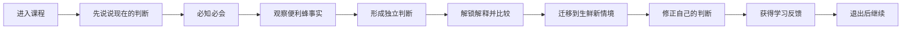

# 商业模式大课学习闭环 V5：十节点产品合同

状态：**设计提案，尚未实现**  
设计版本：`learning-loop-contract.v1`  
目标课程包：`5.0.0-learning-loop-pilot`  
前序运行版本：`4.0.0-learning-first-orientation`

## 1. 设计总则

- [KNOWN, HIGH] 继续沿用一门课一条 PBL 会话、单角色、单问、版本化课程包和事件账本。
- [INFERRED, HIGH] V5 将“是否允许继续”和“是否形成学习证据”拆开：前者由非空学习动作驱动，后者由事实、因果、提示等级和泄露检查决定。
- [INFERRED, HIGH] “不知道”可以完成当前交互并进入下一节点，但结果只能记录为 `assisted` 或 `unsupported`，不能成为自主掌握证据。
- [INFERRED, HIGH] 教学前基线只占一个回合，不设资格门，不评价对错，回答后立即进入讲授。
- [INFERRED, HIGH] 第一轮闭环固定使用便利蜂做教学案例、生鲜零售做未见迁移案例；不接入个人项目和正式测评。

## 2. 学员可见主链

[INFERRED, HIGH] 学员只看到当前任务、必要内容和唯一下一步；不会看到节点编号、证据状态、内部规则或结果分类。

## 3. 十节点产品合同

### N0 `session_entry`：进入同一课程会话

| 字段 | 定义 |
|---|---|
| learner_goal | 知道自己已经进入课程，并明确当前只需要完成一个学习动作。 |
| entry_condition | 学员点击商业模式大课；系统取得稳定 `learnerId + courseId + packageVersion`。 |
| learner_visible_experience | 直接进入统一工作台；新会话显示教授的一个开场问题，旧会话显示上次节点与下一步。 |
| primary_agent | 教授；恢复时沿用当前节点指定角色。 |
| teaching_action | 新会话简短说明“先看你现在怎么判断，再一起学习”；恢复会话只做一句上下文回接。 |
| input_data | 课程注册、稳定会话键、课程包版本、已有 `projectV2` 快照。 |
| allowed_knowledge | 课程标题、当前节点标题、上次学员原始消息摘要。 |
| forbidden_knowledge | 隐藏分析、证据维度、结果分类、其他学员数据。 |
| learner_output | 无强制输出；进入后回答 N1。 |
| evidence_output | `session_entered` 或 `session_resumed`。 |
| state_event | 保存课程包、会话版本、恢复节点和进入时间。 |
| exit_condition | 工作台已加载唯一当前 microtask。 |
| non_blocking_fallback | 快照损坏时停止自动推进，显示可解释的恢复失败，不新建第二条同课会话。 |
| resume_behavior | 每次进入都由 PBL 当前 microtask 派生唯一下一步。 |
| failure_state | 同一会话出现两个活动任务、恢复后节点倒退、读取到他人会话。 |

### N1 `baseline_capture`：保存教学前初始判断

| 字段 | 定义 |
|---|---|
| learner_goal | 在没有课程提示前，说出自己现在会从什么角度判断商业模式。 |
| entry_condition | 新会话首次进入；尚未向学员披露概念片段和案例分析。 |
| learner_visible_experience | 教授只问：`一家店的产品卖得很好，为什么还不能据此判断它的商业模式成立？` |
| primary_agent | 教授。 |
| teaching_action | 只收集，不纠正、不追问对错。 |
| input_data | 问题模板，不读取教材、便利蜂或生鲜内容。 |
| allowed_knowledge | 仅问题本身。 |
| forbidden_knowledge | 商业模式定义、六要素名称、案例事实、作者分析。 |
| learner_output | 原始回答、明确“不知道”或拒答。 |
| evidence_output | `LearnerClaim{claimType: baseline, status: captured|unknown|declined}`。 |
| state_event | `baseline_captured`，保存原文消息，不生成掌握结论。 |
| exit_condition | 收到一条非空回答；任何语义均可推进。 |
| non_blocking_fallback | 不知道/拒答直接记录，不重复问题，下一节点立刻教学。 |
| resume_behavior | 已有 baseline 时不重复采集；恢复后直接进入 N2。 |
| failure_state | 在基线前泄露定义；把“不知道”写成错误答案；连续追问基线。 |

### N2 `must_know_instruction`：必知必会短讲授

| 字段 | 定义 |
|---|---|
| learner_goal | 理解商业模式不等于产品、收入或单笔交易。 |
| entry_condition | N1 已留下基线记录。 |
| learner_visible_experience | 教授给 80-140 字核验讲授，再问一个概念区分问题。 |
| primary_agent | 教授。 |
| teaching_action | 解释交易主体、交易内容、交易方式、成本风险与价值分配的最小关系。 |
| input_data | 主教材核验片段和课程编辑短讲稿。 |
| allowed_knowledge | `transaction-principle-definition`、`six-elements-overview-definition`。 |
| forbidden_knowledge | 便利蜂作者分析、完整六关结构、评分与证据术语。 |
| learner_output | 用自己的话做一次区分；也可回答不知道。 |
| evidence_output | `concept_distinction`，状态为 autonomous/hinted/assisted/unsupported。 |
| state_event | `instruction_delivered`、`evidence_evaluated`。 |
| exit_condition | 学员完成一次回应；质量决定证据状态，不决定能否继续。 |
| non_blocking_fallback | 首次不知道给一个二选一支架；再次不知道记录 assisted 并继续。 |
| resume_behavior | 已发送讲授但未回答时恢复同一问题；已回答时进入 N3。 |
| failure_state | 只问不教；讲授超过当前概念范围；把 assisted 写成已掌握。 |

### N3 `bee_fact_observation`：便利蜂事实观察

| 字段 | 定义 |
|---|---|
| learner_goal | 从事实中先看见“谁获得信息、谁做决定、谁执行”。 |
| entry_condition | N2 已完成一次回应。 |
| learner_visible_experience | 学长呈现一张包含 3-5 条编号事实的案例观察卡，只问学员注意到哪项变化。 |
| primary_agent | 学长。 |
| teaching_action | 引导观察，不解释结论。角色切换时说明仍在同一学习进度。 |
| input_data | 便利蜂 learner-visible、verified 事实及来源页码。 |
| allowed_knowledge | `bee-f2`、`bee-f4` 及补充核验后的数据/订货事实。 |
| forbidden_knowledge | `bianlifeng-analysis`、六要素画布、作者结论。 |
| learner_output | 选择或引用至少一条事实，或明确不知道从哪里看。 |
| evidence_output | `fact_observation{factIds, messageId}`；不知道则 factIds 为空。 |
| state_event | `case_facts_disclosed`、`fact_observation_recorded`。 |
| exit_condition | 学员对事实做出一次观察；无事实引用也可进入 N4，但标记需要支架。 |
| non_blocking_fallback | 学长指向一个事实编号并问“这条事实里谁的动作变了”，不说答案。 |
| resume_behavior | 恢复时保留相同事实卡和未完成问题，不重新随机选事实。 |
| failure_state | 展示作者结论；事实没有来源；刷新后事实集合改变。 |

### N4 `bee_independent_commit`：学员独立形成判断

| 字段 | 定义 |
|---|---|
| learner_goal | 把事实组织成一条自己的商业模式判断。 |
| entry_condition | N3 已披露固定事实集。 |
| learner_visible_experience | 学长要求学员只回答：`这些变化重新分配了哪项决策权，并可能带来什么结果？` |
| primary_agent | 学长。 |
| teaching_action | 只给句式支架，不提供作者结论。 |
| input_data | N3 固定事实集、学员观察、当前提示等级。 |
| allowed_knowledge | learner facts 和学员自己的历史消息。 |
| forbidden_knowledge | locked analysis、标准答案、其他学员回答。 |
| learner_output | 一条独立判断，结构为事实/关系变化/可能结果；或不知道/索要答案。 |
| evidence_output | `LearnerClaim{claimType: case_commit, factIds, causalLink, supportStatus}`。 |
| state_event | `case_commit_recorded`；原文冻结后不可覆盖，只能追加 revision。 |
| exit_condition | 收到一条非空承诺；自主判断、空判断和拒答都能结束节点，但证据状态不同。 |
| non_blocking_fallback | 两级支架后仍不知道时冻结 `no_claim`，进入教学解释；结果最高只能是 B 类。 |
| resume_behavior | 已提交 commit 时绝不再次请求提交；直接进入 N5。 |
| failure_state | 在 commit 前读取 locked analysis；把系统生成内容保存为 learner claim。 |

### N5 `bee_unlock_compare`：解锁课程解释并比较

| 字段 | 定义 |
|---|---|
| learner_goal | 看见课程解释与自己判断的相同、遗漏和不同，而不是抄一个标准答案。 |
| entry_condition | N4 已产生不可变 `case_commit_recorded`，包括 `no_claim`。 |
| learner_visible_experience | 教授解锁一段 100-180 字课程解释，并只问“它补充了你原判断中的哪一处关系？” |
| primary_agent | 教授。 |
| teaching_action | 明确课程解释是比较材料，不是唯一答案。 |
| input_data | locked analysis、便利蜂 commit、关联事实。 |
| allowed_knowledge | N4 后才可读取的 `bianlifeng-analysis`，仅当前问题需要的片段。 |
| forbidden_knowledge | 生鲜迁移答案、评分规则、完整作者报告。 |
| learner_output | 比较陈述，指出一致、补充或不同；不知道也可继续。 |
| evidence_output | `comparison{commitClaimId, analysisSectionIds, difference, status}`。 |
| state_event | `analysis_unlocked`、`comparison_recorded`。 |
| exit_condition | 解锁事件与一次学员比较均已记录。 |
| non_blocking_fallback | 教授直接讲明一处差异并记录 assisted，不重复要求学员猜。 |
| resume_behavior | 解锁不可回退；恢复时继续显示已解锁片段和同一比较状态。 |
| failure_state | 没有 commit 就解锁；比较记录覆盖原 commit；把作者分析写成事实。 |

### N6 `fresh_transfer`：生鲜零售新情境迁移

| 字段 | 定义 |
|---|---|
| learner_goal | 在没有作者解释的新案例中使用刚学到的观察方式。 |
| entry_condition | N5 完成；此前未向学员展示生鲜分析。 |
| learner_visible_experience | 神秘角色给出两个生鲜模式的 4-6 条可比事实，只问一条迁移问题。 |
| primary_agent | 神秘角色。 |
| teaching_action | 制造模式差异张力，不提示应选择哪个模式。 |
| input_data | 带观察年份的生鲜案例 learner facts、便利蜂学习证据。 |
| allowed_knowledge | 两种模式的仓网/门店、库存责任、配送、流量或回款事实。 |
| forbidden_knowledge | 生鲜作者结论、盈利优劣结论、便利蜂答案模板。 |
| learner_output | 一条“事实 → 关系变化 → 可能结果”的迁移判断。 |
| evidence_output | `LearnerClaim{claimType: transfer, factIds, causalLink, status}`。 |
| state_event | `transfer_prompt_delivered`、`transfer_claim_recorded`。 |
| exit_condition | 收到非空回应；A 类结果要求至少一条 autonomous，流程可由 assisted 完成。 |
| non_blocking_fallback | 提供事实聚焦支架，但不提供因果结论；仍不知道则 assisted 继续。 |
| resume_behavior | 恢复时保持同一模式对和同一事实集，避免换题污染迁移测量。 |
| failure_state | 事实不可比较；把观察时点当当前数据；提示直接包含因果答案。 |

### N7 `judgment_revision`：修正判断

| 字段 | 定义 |
|---|---|
| learner_goal | 清楚表达自己现在比课程开始时多看见了什么。 |
| entry_condition | N1 baseline 与 N6 transfer 均已记录。 |
| learner_visible_experience | 成长反馈官并排回放学员自己的两段原文，只问“现在你会怎样修正最初的判断，依据是什么？” |
| primary_agent | 成长反馈官。 |
| teaching_action | 只回放，不替学员写 revision。 |
| input_data | baseline、bee commit、comparison、transfer 及引用事实。 |
| allowed_knowledge | 学员自己的原文和已经解锁的课程内容。 |
| forbidden_knowledge | 隐藏评分、其他学员数据、模型推断出的虚构动机。 |
| learner_output | before/after/reason，或无法修正。 |
| evidence_output | `JudgmentRevision{beforeClaimId, afterText, reason, factIds, supportStatus}`。 |
| state_event | `judgment_revision_recorded`。 |
| exit_condition | 一次 revision 尝试已保存；无法修正也允许进入反馈。 |
| non_blocking_fallback | 提供句式“我原来主要看___，现在会同时看___，因为事实___”；仍不会则 assisted。 |
| resume_behavior | revision 以版本追加，不覆盖 baseline 或 commit。 |
| failure_state | 系统代写后标为学员修正；无法定位 before；没有依据却宣称成长。 |

### N8 `evidence_feedback`：生成非分数反馈

| 字段 | 定义 |
|---|---|
| learner_goal | 知道本次具体完成了什么、哪里仍依赖支架、下一步应观察什么。 |
| entry_condition | N7 已结束，证据账本完整。 |
| learner_visible_experience | 成长反馈官输出三段：判断变化、证据独立性、下一步观察建议；不提分数和内部维度。 |
| primary_agent | 成长反馈官。 |
| teaching_action | 从证据模板生成反馈，LLM 只润色，不增加无来源结论。 |
| input_data | claim、evidence decision、revision、提示等级、故障记录。 |
| allowed_knowledge | 学员证据和课程已披露内容。 |
| forbidden_knowledge | 正式分数、人格诊断、十五境定级、隐藏 rubric。 |
| learner_output | 可选确认或继续提问；不作为闭环完成条件。 |
| evidence_output | `LearningFeedback{statements[], evidenceRefs[], suggestions[]}`。 |
| state_event | `learning_feedback_generated`、`loop_outcome_classified`。 |
| exit_condition | 每个事实性反馈句都有 evidenceRef；结果分类为 A/B/C。 |
| non_blocking_fallback | LLM 失败时使用确定性模板；缺证据的字段明确写“本次尚未观察到”。 |
| resume_behavior | 同一证据版本生成相同反馈，不重复创建多个报告。 |
| failure_state | 显示数字分；把 assisted 说成掌握；反馈无法回到原文。 |

### N9 `session_resume_check`：退出并恢复同一会话

| 字段 | 定义 |
|---|---|
| learner_goal | 离开后回来仍能继续，不需要回忆系统状态或重做任务。 |
| entry_condition | 任一节点保存后均可退出；闭环验收至少在 N4 或 N6 中断一次。 |
| learner_visible_experience | 返回课程卡显示“继续学习”和上次停留任务；进入后显示一条自然回接。 |
| primary_agent | 当前节点指定 Agent，不额外创建恢复角色。 |
| teaching_action | 回接上次事实、未完成动作和唯一下一步，不重讲全部历史。 |
| input_data | 权威 projectV2 快照、事件序列、最新 messageId。 |
| allowed_knowledge | 当前学员当前课程的数据。 |
| forbidden_knowledge | 其他版本会话、其他学员、小组未授权数据。 |
| learner_output | 继续当前任务。 |
| evidence_output | `resume_verified{expectedNode, actualNode, evidenceIntact}`。 |
| state_event | `session_resumed`；不得重复写入旧节点事件。 |
| exit_condition | 恢复节点、已披露内容、claim 和提示等级一致。 |
| non_blocking_fallback | 恢复不一致时停止推进并显示恢复异常；不得静默新建会话。 |
| resume_behavior | 同上，这是该节点本身的验收对象。 |
| failure_state | 节点倒退、双活动任务、重复问题、证据或解锁状态丢失。 |

## 4. 数据范围矩阵

| 节点 | 可读课程内容 | 可读案例事实 | 可读锁定分析 | 可读学员数据 | 可写核心数据 |
|---|---|---|---|---|---|
| N0 | 课程元数据 | 无 | 否 | 当前会话快照 | enter/resume event |
| N1 | 无 | 无 | 否 | 无 | baseline claim |
| N2 | 主教材最小片段 | 无 | 否 | baseline 原文 | concept evidence |
| N3 | 已讲概念 | 便利蜂固定 facts | 否 | 概念回应 | observation |
| N4 | 已讲概念 | 同一便利蜂 facts | 否 | observation | immutable commit |
| N5 | 已讲概念 | 便利蜂 facts | 是，仅 commit 后 | commit | comparison |
| N6 | 已讲概念 | 生鲜固定 facts | 否 | 已完成证据摘要 | transfer claim |
| N7 | 已披露内容 | 已披露 facts | 已解锁便利蜂片段 | baseline/commit/transfer | revision |
| N8 | 已披露内容 | 引用到的 facts | 仅已解锁部分 | 全部本轮证据 | feedback/outcome |
| N9 | 当前节点需要内容 | 已披露集合 | 按披露状态 | 当前学员全会话 | resume event |

## 5. 学员视角可跑通审计

| 节点 | 我为什么做 | 我看见什么 | 我只做什么 | 不知道会怎样 | 为什么能继续 |
|---|---|---|---|---|---|
| N1 | 留下现在的看法 | 一个生活化问题 | 说当前判断 | 记录不知道，马上教学 | 基线不设门槛 |
| N2 | 建立最小概念 | 一段短讲授 | 做一个区分 | 支架后 assisted | 回应即完成，质量另记 |
| N3 | 学会先看事实 | 编号事实卡 | 说哪项变化 | 聚焦一条事实 | 观察完成，不要求结论正确 |
| N4 | 留下自己的判断 | 同一事实卡 | 写一条因果判断 | 记录 no_claim | 先承诺或明确不承诺，才能教学 |
| N5 | 和课程解释比较 | 自己原文 + 解锁片段 | 说一处差异 | 教授讲一处差异 | 比较动作已发生 |
| N6 | 看能否换情境使用 | 新案例固定事实 | 写一条迁移判断 | 事实支架后 assisted | 流程可继续，结果降为 B |
| N7 | 看见前后变化 | 自己的前后原文 | 写修正与依据 | 句式支架 | revision 尝试已保存 |
| N8 | 得到可信反馈 | 三段自然语言反馈 | 阅读即可 | 不适用 | 证据报告已生成 |
| N9 | 继续而不是重来 | 上次停留和下一步 | 继续当前动作 | 不适用 | 权威快照恢复成功 |

[INFERRED, HIGH] 按该合同，学员链路在逻辑上可跑通；但 N3、N5、N6 的内容包和 N7、N8 的数据对象仍未实现，因此当前产品还不能执行该合同。

