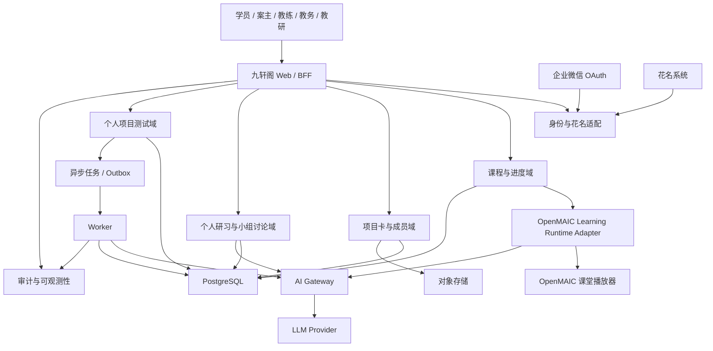

# 九轩阁 MAIC V6 生产架构

版本：`6.0.0-rc`

状态：Gate 0 架构冻结候选

## 1. 架构结论

[INFERRED, HIGH] V6 继续采用模块化单体，不按身份、项目、讨论、测评拆成多个微服务。

首发部署单元：

```text
一个 Next.js Web/BFF
一个异步 Worker
一个 PostgreSQL
一个 S3 兼容对象存储
一个服务端 AI Gateway
```

OpenMAIC 继续作为课堂运行时和播放器，不成为九轩阁身份、项目、讨论、测评与权限的业务事实源。

## 2. 逻辑架构



## 3. 模块边界

```text
lib/jiuxuange-v6/
├── identity
├── roster
├── enrollment
├── course
├── project
├── discussion
├── notes
├── project-archive
├── assessment
├── ai-gateway
├── audit
└── runtime-adapter
```

实际文件路径由 Gate 1 仓库设计确认，以上是领域边界，不要求机械生成同名目录。

## 4. 身份与关系

内部身份：

```text
User
- id
- status
- created_at
- updated_at
```

外部绑定：

```text
IdentityBinding
- id
- user_id
- provider
- provider_tenant_id
- provider_subject_id
- roster_person_id
- verified_at
- revoked_at
```

`provider` 首发支持：

```text
wecom
```

花名系统负责实名/花名、班级和初始成员信息；企业微信负责登录认证。任何一方的外部 ID 都不能直接成为业务表主键。

关系对象：

```text
Cohort
Class
Group
Enrollment
GroupMembership
ProjectMembership
CoachAssignment
```

成员关系必须包含：

```text
valid_from
valid_to
status
source
source_version
```

## 5. 核心数据对象

### 5.1 课程

```text
Course
CourseVersion
CourseUnit
CourseEnrollment
LearningSession
UnitProgress
NativeInteractionAttempt
CaseLesson
CaseUnlock
```

服务端权威记录：

- 单元开始与完成；
- required 互动完成状态；
- 客观题答对状态；
- 案例解锁；
- 课堂实例与课程包版本；
- 最近恢复位置。

客户端可以继续保存动画、展开面板和输入框等瞬时 UI 状态，但不得作为正式完成状态的唯一来源。

### 5.2 项目卡

```text
Project
ProjectCard
ProjectCardVersion
ProjectFact
ProjectJudgment
ProjectHypothesis
ProjectUnknown
ProjectAsset
ProjectDisclosurePolicy
CourseConclusion
```

项目卡版本发布后不可修改，只能创建后继版本。

### 5.3 讨论与档案

```text
DiscussionSession
DiscussionParticipant
DiscussionMessage
PersonalLearningNote
ProjectRecord
ProjectRecordVersion
```

`DiscussionSession.mode`：

```text
personal_study
group_discussion
```

所有消息保存：

```text
actor
agent_role
course_id
project_id
project_card_version_id
referenced_fact_ids
hypothesis_ids
prompt_version
model_version
created_at
```

### 5.4 个人项目测试

```text
AssessmentAssignment
QuestionSetVersion
RubricVersion
AssessmentSession
AssessmentDraft
AssessmentAttempt
EvaluationJob
EvaluationReport
CriterionEvaluation
```

提交和评价分成两个事务：

```text
保存正式答案
→ 锁定提交次数
→ 写入 outbox
→ 返回提交成功

Worker 读取 outbox
→ 生成 AI 评价
→ 校验结构化输出
→ 保存评价报告
```

## 6. PostgreSQL 使用原则

PostgreSQL 是业务事实源，但不采用全量 Event Sourcing。

```text
关系表 = 当前和历史业务事实
append-only 事件 = 审计、投影和异步集成依据
outbox = 业务事务与异步任务的一致性边界
```

业务写入和 outbox 必须在同一事务中完成。

示例：

```text
BEGIN
  INSERT assessment_attempt
  UPDATE assessment_session
  INSERT outbox_event
COMMIT
```

## 7. AI Gateway

所有 LLM 调用必须经过服务端 AI Gateway。

处理链：

```text
调用身份与业务用途
→ 数据分类
→ allow/mask/block
→ Prompt 版本装配
→ 模型策略
→ 费用与 Token 上限
→ 超时、重试和降级
→ 结构化输出校验
→ AI Run 审计
```

最小审计字段：

```text
ai_run_id
purpose
actor_user_id
project_card_version_id
model_provider
model_name
prompt_version
rubric_version
retrieved_evidence_ids
input_hash
output_hash
token_usage
cost_estimate
latency_ms
status
error_code
trace_id
```

服务端密钥不得进入浏览器、课程 ZIP、日志或数据库普通字段。

## 8. 对象存储

对象存储保存：

- 企业材料；
- 课程媒体；
- PDF、图片和音视频；
- 作业附件；
- 导出制品。

PostgreSQL 只保存元数据：

```text
asset_id
storage_key
checksum
mime_type
owner_type
owner_id
visibility
model_policy
retention_policy
created_at
```

对象访问使用短时签名 URL，并在授权后生成。

## 9. 权限

V6 不使用纯页面 RBAC。每次读取和写入都检查：

```text
role
+ enrollment
+ group membership
+ project membership
+ coach assignment
+ resource status
+ disclosure level
```

至少验证：

- 学员只能读取本人私有研习和笔记；
- 同组成员只能读取有效期内被授权的共享讨论；
- 退出成员无法读取退出后新增项目内容；
- 案主只能维护自己负责的项目卡；
- 教研默认不能读取企业敏感材料；
- 教务默认不能读取个人私有笔记；
- 教练只能读取分配范围内、且政策允许的数据；
- 管理员导出和敏感访问进入审计日志。

## 10. 1000 人容量边界

[KNOWN, HIGH] 当前只确认总学员数 1000，尚未确认同时在线人数和集中开课时间。

Gate 0 暂定容量模型：

```text
注册学员：1000
持久化学习会话：至少 1000
班级和小组：不设代码上限
LLM 任务：异步排队并按租户、用户和用途限流
```

[ASSUMPTION, MEDIUM] Gate 5 负载测试暂以 200 个并发活跃用户和 50 个并发 LLM Job 为起点。取得正式课程时刻表后必须重新冻结，不得把暂定值写成已确认业务事实。

## 11. 可观测性与恢复

必须具备：

```text
结构化日志
trace_id
请求与 Worker 链路
错误率和延迟指标
AI Token 与费用指标
队列积压
数据库连接池
备份状态
安全审计
```

恢复门槛：

- PostgreSQL 定时备份；
- 对象存储版本或备份策略；
- 至少一次恢复演练；
- 版本化数据库迁移；
- 应用回退不删除或降级已有数据；
- 发布前保留代码、数据库迁移、课程包、Prompt 和内容制品版本。

## 12. 迁移策略

[DECIDED, HIGH] 旧 IndexedDB 与本机 JSON 数据不迁移到 V6 正式数据库。

处理方式：

```text
旧 V5/V5.1 课堂：只读归档
旧双入口演示数据：开发 fixture
V6 正式用户：创建全新服务端账户、课程会话和项目记录
```

V6 开发期间使用独立功能开关和数据库 schema。发布前不得删除旧代码和旧标签。

## 13. 尚未冻结的技术选择

Gate 1 前必须通过 ADR 决定：

1. PostgreSQL schema 与迁移工具；
2. Worker 和任务队列实现；
3. 对象存储 Provider；
4. 企业微信 OAuth 接入模式；
5. 花名系统同步或导入模式；
6. Session、CSRF 和 Cookie 策略；
7. 生产部署平台；
8. 日志、指标和告警 Provider；
9. LLM Provider、模型和预算；
10. 数据保留、删除和导出策略。

不得因这些尚未确定而在业务模块中直接耦合某个供应商。

[RULES I BROKE]: 无
